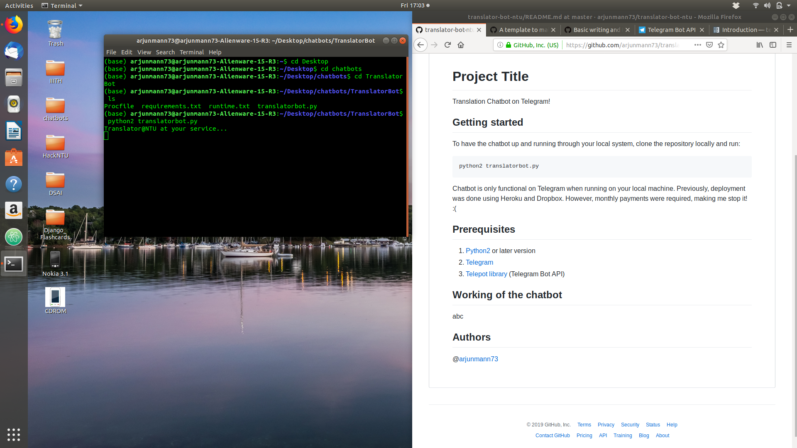
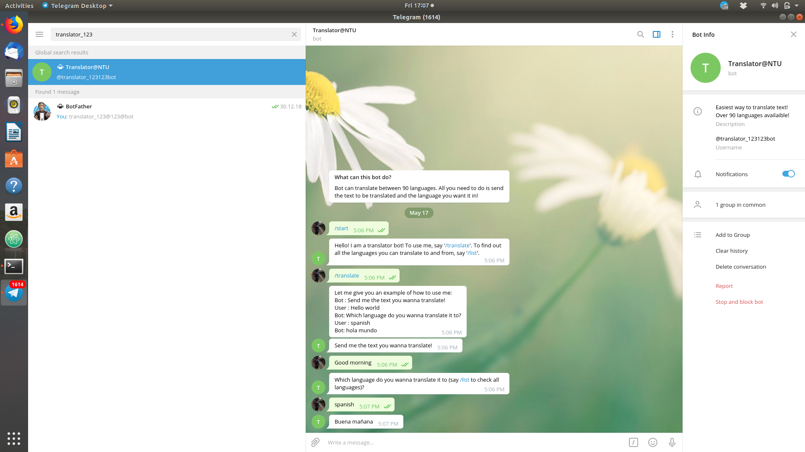
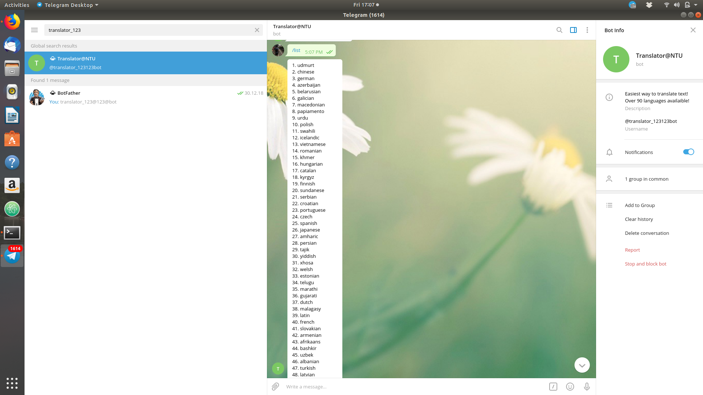

## Project Title
Translation Chatbot on Telegram!

## Getting started
To have the chatbot up and running through your local system, clone the repository locally and run:
```
python2 translatorbot.py
```
Chatbot is only functional on Telegram when running on your local machine. Previously, deployment was done using Heroku and Dropbox. However, monthly payments were required, making me stop it! :(

## Built With
1. [Python](https://www.python.org/downloads/) 
2. [Telegram](https://telegram.org/)
3. [Telepot library](https://telepot.readthedocs.io/en/latest/) (Telegram Bot API)
4. [Yandex.Translate](https://translate.yandex.com/) (Third-party API)

## Working of the chatbot
#### 1. Firing up the chatbot
Run the command: ``` python2 translatorbot.py ```, <br>
and if all goes well, you will see the message: Translator@NTU at your service....

---


#### 2. Finding the chatbot on telegram
Search for @translator_123123bot in the search bar and hit start to interact with the chatbot!

---


#### 3. /translate 
The first recognised command is /translate. Following is how you use it:

---


#### 4. /list
The second recognised command is /list. It shows you all the possible 90 languages:

---


## Author
@[arjunmann73](https://github.com/arjunmann73)

