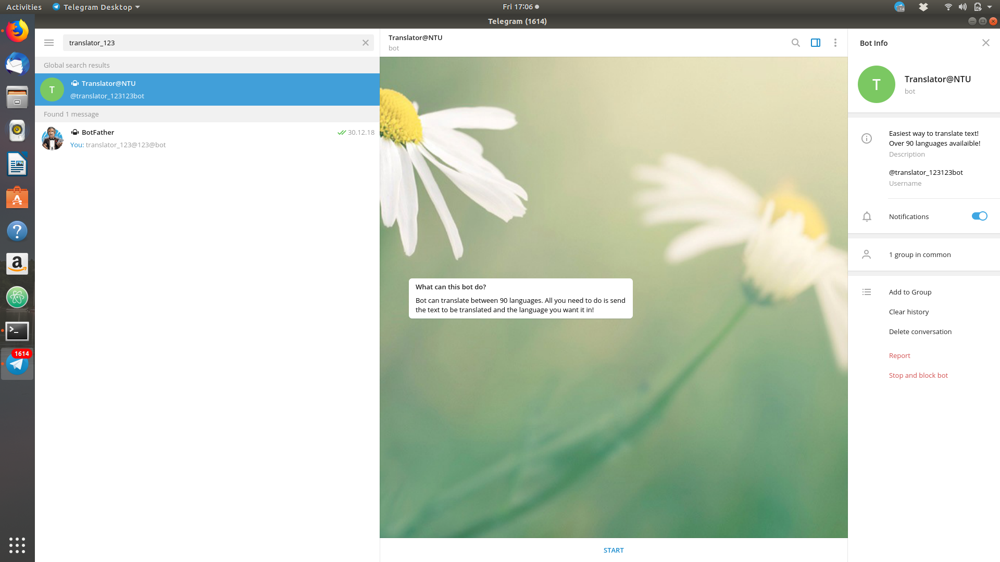

# Project Title
Translation Chatbot on Telegram!

## Getting started
To have the chatbot up and running through your local system, clone the repository locally and run:
```
python2 translatorbot.py
```
Chatbot is only functional on Telegram when running on your local machine. Previously, deployment was done using Heroku and Dropbox. However, monthly payments were required, making me stop it! :(

## Prerequisites
1. [Python2](https://www.python.org/downloads/) or later version
2. [Telegram](https://telegram.org/)
3. [Telepot library](https://telepot.readthedocs.io/en/latest/) (Telegram Bot API)

## Working of the chatbot
#### 1. Firing up the chatbot
Run the command: ``` python2 translatorbot.py ```, 
and if all goes well, you will see the message: TranslatorNTU is up and running!....


## Authors
@[arjunmann73](https://github.com/arjunmann73)

